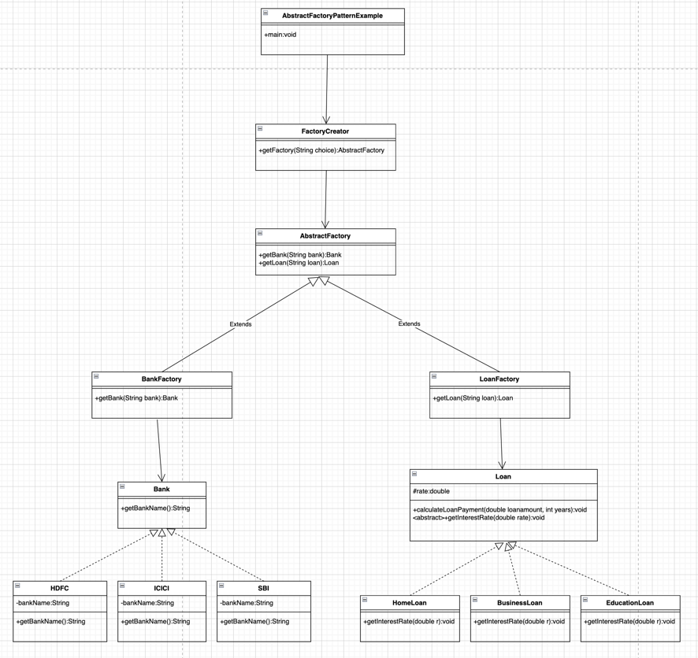

## 抽象工厂
> 抽象工厂模式，只定义一个接口或抽象类来创建相关(或依赖)对象家族，但没有指定它们的具体子类。这意味着抽象工厂允许一个类返回一个类的工厂。因此，这就是抽象工厂模式比工厂模式高一级的原因。

>抽象工厂模式也被称为工具包。

### 抽象工厂模式的优势
* 抽象工厂模式将客户端代码与具体(实现)类隔离开来。
* 它简化了对象族的交换。
* 它促进了对象之间的一致性。
### 抽象工厂模式的使用
* 当系统需要独立于其对象的创建、组合和表示方式时。
* 当相关对象家族必须一起使用时，则需要强制执行此约束。
* 当您希望提供不显示实现而只显示接口的对象库时。
* 当系统需要配置多个对象族中的一个时。

### UML图如下
