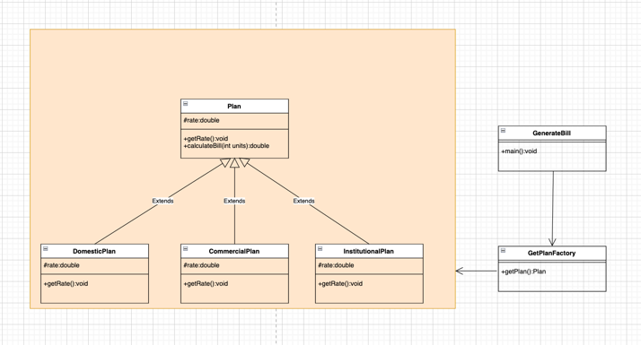

## 工厂模式
工厂模式或工厂方法模式只定义一个接口或抽象类来创建对象，但让子类来决定实例化哪个类。换句话说，子类负责创建类的实例。

工厂方法模式也被称为虚拟构造函数。

<b>工厂设计模式的优势：</b>
* 工厂方法模式允许子类选择要创建的对象类型。
* 它消除了将特定于应用程序的类绑定到代码中的需要，从而促进了松耦合。这意味着代码只与生成的接口或抽象类交互，因此它将与实现该接口或扩展该抽象类的任何类一起工作。

<b>工厂设计模式的使用</b>
* 当一个类不知道需要创建什么子类时
* 当一个类希望它的子类指定要创建的对象时。
* 当父类选择为其子类创建对象时。

其UML图如下

 