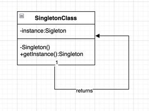

## 单例设计模式

>单例模式就是“定义一个只有一个实例并提供全局访问点的类”。

>换句话说，一个类必须确保只创建单个实例，并且所有其他类都可以使用单个对象。

### 单例设计模式有两种形式

>* 早期实例化：在加载时创建实例。
>* 惰性实例化：在需要时创建实例。

### 单例设计模式的优势
> 节省内存，因为不是在每次请求时都创建对象。 只有单个实例被一次又一次地重用。

### 单例设计模式的使用
> 单例模式主要用于多线程和数据库应用程序。 它用于日志记录、缓存、线程池、配置设置等。

### 单例设计模式的UML

